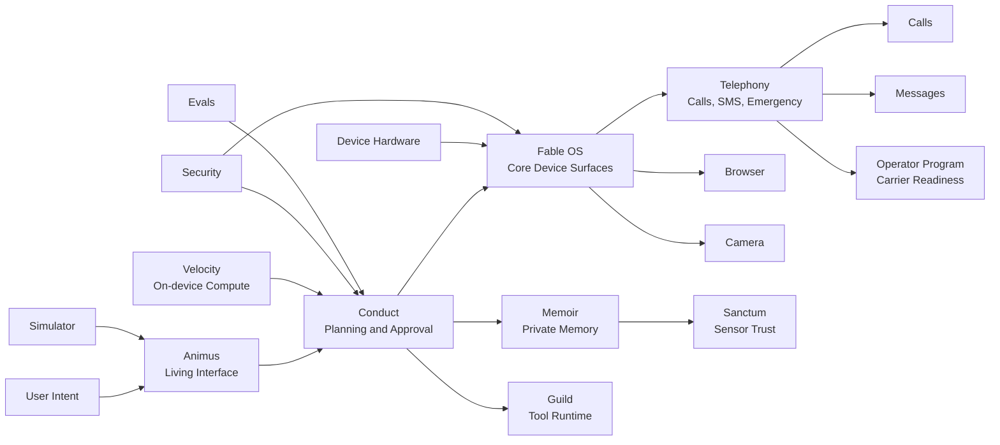

# Fable Intelligence

     

Fable is building the trusted mobile computer for the agentic era: a device where intelligence is the operating model, not another layer of icons, feeds, and manual app management.

The company thesis is simple and demanding: the next great personal computer will feel calmer, more capable, more private, and more alive than today's phone. Fable should handle calls, messages, browsing, capture, memory, planning, and daily work through a first-party intelligence layer that earns trust action by action.

## Product North Star

Fable is designed around five product laws.

| Law | Meaning |
| --- | --- |
| **Intent over icons** | The user says what they want; Fable plans, asks when needed, and executes through trusted device surfaces. |
| **Permission before consequence** | Calls, sends, purchases, public posts, sensor capture, and external data sharing require clear confirmation. |
| **Private by architecture** | Local context, sensor state, retention, and erasure are design primitives rather than afterthoughts. |
| **Operator-grade reliability** | Telephony, messaging, emergency behavior, eSIM, battery, recovery, and certification are first-class workstreams. |
| **Proof before hype** | Every launch-critical claim must map to a prototype, evaluation, user study, operator gate, or hardware proof. |

## System Map

## Repository Map

| Repository | Ownership |
| --- | --- |
| [`fable-strategy`](https://github.com/fable-intelligence/fable-strategy) | Company thesis, launch gates, capital sequencing, and founder operating cadence. |
| [`fable-architecture`](https://github.com/fable-intelligence/fable-architecture) | System context, service contracts, ADRs, trust boundaries, and cross-repo integration. |
| [`fable-os`](https://github.com/fable-intelligence/fable-os) | AOSP strategy, system services, telephony, SMS/MMS, RCS readiness, settings, recovery, and shell. |
| [`fable-telephony`](https://github.com/fable-intelligence/fable-telephony) | Calls, SMS, RCS fallback, eSIM, IMS, VoLTE, VoWiFi, emergency behavior, roaming policy, and phone-grade readiness. |
| [`fable-animus`](https://github.com/fable-intelligence/fable-animus) | Intent canvas, confirmation cards, core surfaces, and the living interaction model. |
| [`fable-conduct`](https://github.com/fable-intelligence/fable-conduct) | Planning, approval policy, action execution, reversibility, and user-visible control. |
| [`fable-memoir`](https://github.com/fable-intelligence/fable-memoir) | Private memory, user context, retention, erasure, provenance, and recall policy. |
| [`fable-sanctum`](https://github.com/fable-intelligence/fable-sanctum) | Privacy hardware, sensor disclosure, device trust states, and physical interaction semantics. |
| [`fable-velocity`](https://github.com/fable-intelligence/fable-velocity) | On-device compute, inference budgets, latency, battery, thermal, and silicon roadmap. |
| [`fable-conduit`](https://github.com/fable-intelligence/fable-conduit) | Calls, messages, browsing, camera, calendar, maps, mail, and external service connectors. |
| [`fable-guild`](https://github.com/fable-intelligence/fable-guild) | Tool runtime, permissions, execution sandbox, capability registry, and developer ergonomics. |
| [`fable-sdk`](https://github.com/fable-intelligence/fable-sdk) | External developer contracts, package surface, examples, and integration rules. |
| [`fable-device-hardware`](https://github.com/fable-intelligence/fable-device-hardware) | Industrial design, board architecture, antenna, battery, sensors, camera, and EVT/DVT/PVT gates. |
| [`fable-operator-program`](https://github.com/fable-intelligence/fable-operator-program) | Carrier strategy, eSIM, certification, emergency services, MVNO/MNO sequencing, and launch markets. |
| [`fable-media-surface`](https://github.com/fable-intelligence/fable-media-surface) | Camera, capture, gallery, creation, private media intelligence, and review flows. |
| [`fable-web-surface`](https://github.com/fable-intelligence/fable-web-surface) | Browser, reading, web actions, credential handling, and safe automation. |
| [`fable-security`](https://github.com/fable-intelligence/fable-security) | Threat models, secure architecture, key management, privacy review, and abuse prevention. |
| [`fable-evals`](https://github.com/fable-intelligence/fable-evals) | Product, safety, reliability, latency, trust, and task-success evaluations. |
| [`fable-infra`](https://github.com/fable-intelligence/fable-infra) | Cloud control plane, observability, build systems, release hygiene, and fleet operations. |
| [`fable-design-system`](https://github.com/fable-intelligence/fable-design-system) | Visual language, interaction tokens, motion, haptics, accessibility, and component standards. |
| [`fable-simulator`](https://github.com/fable-intelligence/fable-simulator) | End-to-end simulator used to prove daily utility before hardware spend. |

## Current Build Priorities

1. Make the simulator a credible daily workflow proof for calls, texts, browsing, camera capture, and day planning.
2. Define the production contracts each repo must satisfy before it can influence device, operator, or silicon decisions.
3. Move from documents to executable interface contracts with tests, scorecards, and audit trails.
4. Use operator readiness as a core product requirement, not a late business-development activity.
5. Keep the design premium, calm, and trustworthy while proving the technology underneath it.

## Engineering Bar

Every repository must maintain:

- a clear ownership boundary and non-goals;
- executable validation for its production contract;
- documented interface contracts with adjacent repositories;
- measurable launch gates;
- security, privacy, and reliability review criteria;
- tests for anything that can affect user trust, device behavior, operator readiness, or external action.

## Operating Cadence

| Rhythm | Output |
| --- | --- |
| Daily | One visible progress note per active workstream: shipped, learned, blocked, next. |
| Weekly | Demo or decision review tied to measurable proof. |
| Before external action | Approval, disclosure, audit event, and recovery path. |
| Before hardware impact | Product, security, operator, support, cost, thermal, battery, and manufacturability review. |
| Before partner claim | Evidence of partner path, certification requirement, or explicit simulation label. |

## Repository Access

Most engineering repositories are private while Fable is in formation. Do not publish, mirror, export, or share private repository contents outside approved Fable channels. Secrets, credentials, personal user data, operator credentials, private keys, supplier quotes under NDA, and investor-only material do not belong in Git.
